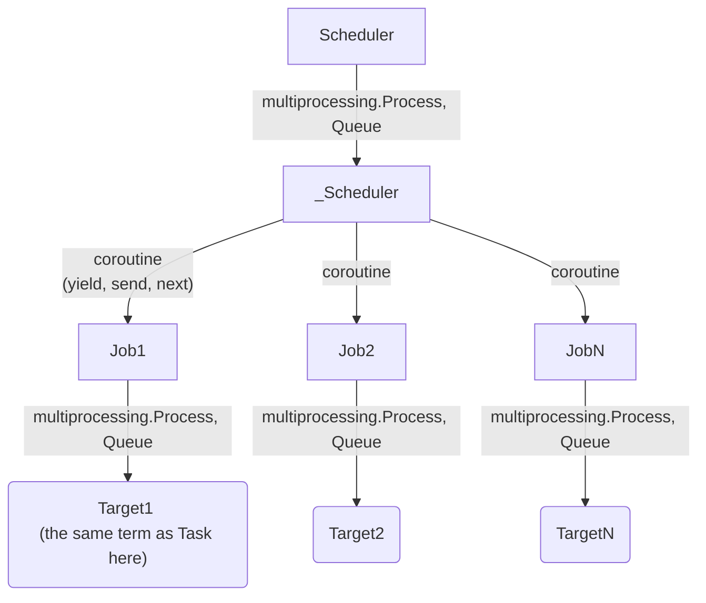

# How this works?

```mermaid
graph TD
    Scheduler --> |multiprocessing.Process, Queue| _Scheduler
    _Scheduler --> |"coroutine\n(yield, send, next)"| Job1
    _Scheduler --> |coroutine| Job2
    _Scheduler --> |coroutine| JobN
    Job1 --> |multiprocessing.Process, Queue| Target1("Target1 \n(the same term as Task here)")
    Job2 --> |multiprocessing.Process, Queue| Target2("Target2")
    JobN --> |multiprocessing.Process, Queue| TargetN("TargetN")
```
