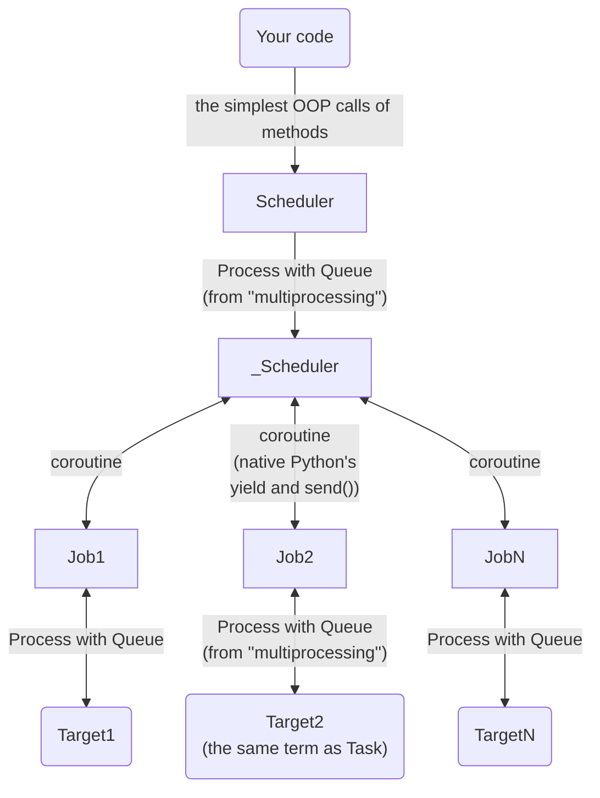

# How this works?

```mermaid
graph TD
    your_code("Your code") --> |the simplest OOP calls of methods| Scheduler
    Scheduler --> |"Process with Queue\n(from ''multiprocessing'')"| _Scheduler
    _Scheduler <--> |coroutine| Job1
    _Scheduler <--> |"coroutine\n(native Python's\nyield and send())"| Job2
    _Scheduler <--> |coroutine| JobN
    Job1 <--> |"Process with Queue"| Target1("Target1")
    Job2 <--> |"Process with Queue\n(from ''multiprocessing'')"| Target2("Target2 \n(the same term as Task)")
    JobN <--> |"Process with Queue"| TargetN("TargetN")
```
